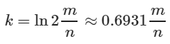

# Фильтр Блума (Bloom filter)
## Описание структуры данных
**Фильтр Блума** (англ. Bloom filter) — это реализация вероятностного множества, придуманная Бёртоном Блумом в 1970 году, позволяющая компактно хранить элементы и проверять принадлежность заданного элемента к множеству. При этом существует возможность получить ложноположительное срабатывание (элемента в множестве нет, но структура данных сообщает, что он есть), но не ложноотрицательное.

Фильтр Блума может использовать любой объём памяти, заранее заданный пользователем, причем чем он больше, тем меньше вероятность ложного срабатывания. Поддерживается операция добавления новых элементов в множество, но не удаления существующих (если только не используется модификация со счётчиками). С увеличением размера хранимого множества повышается вероятность ложного срабатывания.

Для добавления элемента e необходимо записать единицы на каждую из позиций h1(e)…hk(e) битового массива.
Чтобы проверить, что элемент E принадлежит множеству хранимых элементов, необходимо проверить состояние битов h1(e)…hk(e). Если хотя бы один из них равен нулю, элемент не принадлежит множеству. Если все они равны единице, то структура данных сообщает, что элемент принадлежит множеству. При этом может возникнуть две ситуации: либо элемент действительно принадлежит к множеству, либо все эти биты оказались установлены при добавлении других элементов, что и является источником ложных срабатываний в этой структуре данных.

Обозначим размер битового массива M, количество хэш-функций K. Для определения оптимального количества хэш-функций воспользуемся достоверной формулой:   
       
где N - предполагаемое количество входных эдементов.

## Описание реализации
Из всего вышесказанного получаем, что структура данных будет иметь 2 основынх метода:  
1. Операция добовления эдемента в множество (***void add(const void *data, size_t len, SBloom * bloom)***)
2. Операция проверки принадлежности элемента к множеству (***bool possibly_contains(const void *data, size_t len, SBloom * bloom)***)

Входные параметры при создании структуры: 
  1. величина массива M
  2. ожидаемое количество входных данных N
  
В конструкторе динамически выделяется память под булевый массив размера M (***для этого используется функция calloc, которая выделяет блок памяти, полностью обнуленный***), это и есть маска фильтра. Далее высчитывается оптимальное число хэш-функций. 

Для высвобождения памяти в функции **delete_bloom** используется функция ***free***

## Вычисление значений K хэш-функций
Для вычисления хэш функций используется **Murmurhash3** - быстрая некриптографическая хэщ-функция с хорошим распределением и отличным лавинным критерием. 

Не предоставляется возможным потребовать от пользователя K независимых хэш-функций. Поэтому для получения любого количества хэшей ьудем использовать формулу: **(hashA + k * hashB) % M**.  

hashA и hashB будем получать при помощи функции ***MurmurHash3_x64_128*** которая возвращает массив из двух 64 битовый беззнакомых числа - два 64 битных хэшкода.
На их основе вычисляется К значений хэш-функций. 

## Интересные ссылки
1. [Дополнительная информация о струткуре](https://neerc.ifmo.ru/wiki/index.php?title=Фильтр_Блума)
2. [C port of Murmur3 hash](https://github.com/PeterScott/murmur3)
